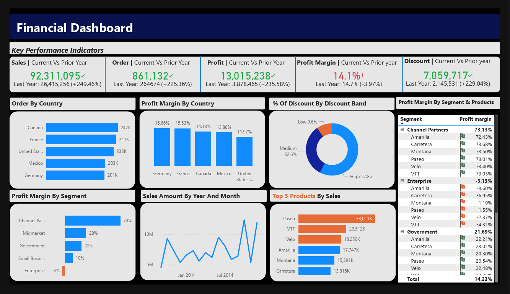

# Financial Dashboard — Power BI



## Project Overview

This project presents a **Finance Department Dashboard** created in Power BI to analyze business performance across sales, orders, profit, profit margin, discounts, countries, customer segments, and products. The dashboard gives a clear executive-level view of financial performance and helps identify growth trends, profitable areas, discount impact, and underperforming segments.

📄 **Dashboard PDF:** [View Finance Department Dashboard PDF](./Finance_Department_Dashboard_PowerBI.pdf)

## Objective

The objective of this dashboard is to make financial performance easier to understand through interactive and visual reporting. It helps answer key business questions such as:

- How are sales, orders, profit, profit margin, and discounts performing compared with the previous year?
- Which countries are contributing the most to order volume and profit margin?
- How are discounts distributed across discount bands?
- Which customer segments are the most and least profitable?
- Which products generate the highest sales?
- How does sales performance change over time?

## Key Performance Indicators

The dashboard highlights current year performance and compares it with the prior year.

| KPI | Current Value | Previous Year | Change |
|---|---:|---:|---:|
| Sales | 92,311,095 | 26,415,256 | +249.46% |
| Orders | 861,132 | 264,674 | +225.36% |
| Profit | 13,015,238 | 3,878,465 | +235.58% |
| Profit Margin | 14.1% | 14.7% | -3.97% |
| Discount | 7,059,717 | 2,145,531 | +229.04% |

## Dashboard Sections

### KPI Summary

The top section of the dashboard displays the main financial KPIs: sales, orders, profit, profit margin, and discount. Each KPI includes current year performance and comparison with the prior year.

### Orders by Country

This section shows order distribution across major countries including Canada, France, United States, Mexico, and Germany. It helps identify which regions are generating the highest order volume.

### Profit Margin by Country

This chart compares profit margin across countries. Germany and France show the highest profit margins, while the United States has the lowest profit margin among the displayed countries.

### Discount Band Analysis

The donut chart shows the percentage distribution of discounts by discount band. High discounts represent the largest share, followed by medium and low discount bands.

### Profit Margin by Segment

This section compares profitability across customer segments. Channel Partners has the strongest profit margin, while Enterprise shows a negative profit margin and may require further analysis.

### Sales Trend by Year and Month

The line chart shows sales movement over time and helps identify monthly changes, seasonal patterns, and periods of strong or weak sales performance.

### Product Sales Performance

The product sales chart highlights the top-performing products by sales amount. Products such as Paseo, VTT, and Velo appear among the strongest contributors.

### Segment and Product Profitability

The detailed table shows profit margin by segment and product. This helps compare product performance within each customer segment and identify profitable or loss-making combinations.

## Key Insights

- Sales, orders, profit, and discounts increased strongly compared with the previous year.
- Profit margin remains positive overall, but it declined slightly compared with the prior year.
- Canada has the highest order volume among the displayed countries.
- Germany and France show the strongest country-level profit margins.
- High discount band accounts for the largest share of discounts.
- Channel Partners is the most profitable segment shown in the dashboard.
- Enterprise has a negative profit margin, making it an important area for business review.
- Paseo is the highest-selling product shown in the product sales section.

## Tools Used

- **Power BI** — dashboard development and visualization
- **Power Query** — data cleaning and transformation
- **DAX** — KPI calculations and comparison measures
- **GitHub** — project documentation and sharing

## Files Included

```text
Financial-Dashboard-PowerBI/
│
├── README.md
├── Finance_Department_Dashboard_PowerBI.pdf
│
└── assets/
    └── financial-dashboard-preview.png
```

## Business Value

This dashboard provides a single-page financial summary that supports faster decision-making. It can help finance and business teams monitor revenue growth, profitability, country-level performance, product contribution, customer segment performance, and discount usage.

## Future Enhancements

- Add more detailed drill-through analysis for country, segment, and product performance.
- Include target versus actual performance comparison.
- Add forecasting for future sales and profit trends.
- Add more filters for deeper financial analysis.
- Create a mobile-friendly dashboard layout.
